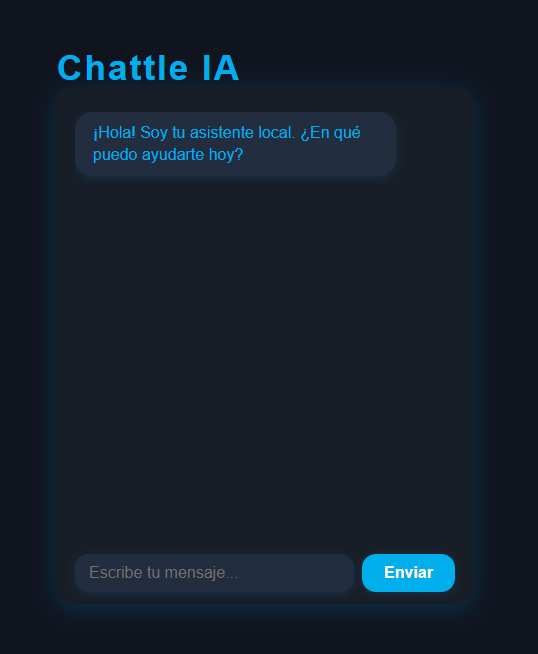
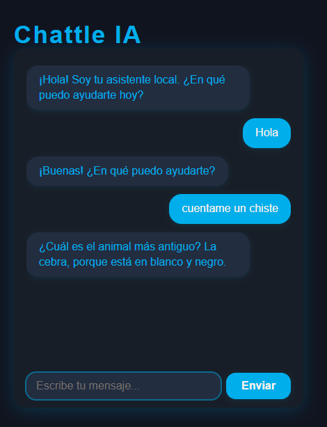

# Chattle IA

**Chattle IA** es una aplicación de escritorio de chat, desarrollada con React y Electron.  
Funciona completamente **offline** y no depende de servicios externos ni de claves API.  
El bot responde automáticamente a preguntas frecuentes, cuenta chistes, curiosidades y permite jugar a piedra, papel o tijera.

---

## 🚀 Características

- Interfaz moderna y sencilla con toques azul eléctrico.
- Chat 100% local y privado, sin conexión a internet ni registro.
- Respuestas automáticas a saludos, preguntas frecuentes, hora, fecha, etc.
- Chistes y curiosidades aleatorias.
- Minijuego de piedra, papel o tijera.
- Código abierto y fácil de personalizar.

---

## 🖥️ Instalación y uso

1. **Clona este repositorio:**

   ```sh
   git clone https://github.com/tu-usuario/chattle-ia.git
   cd chattle-ia
   ```

2. **Instala las dependencias y ejecuta la app:**

   ```sh
   npm install
   npm run start
   ```

---

## 🔒 Privacidad

- No se almacena ni comparte ningún dato fuera de tu equipo.
- Todo el procesamiento es local.

---

## 📦 Construido con

- [React](https://react.dev/)
- [Electron](https://www.electronjs.org/)

---

## 📸 Capturas





---

## 📄 Licencia

MIT

---

**¡Disfruta conversando y jugando con tu asistente local de escritorio!**